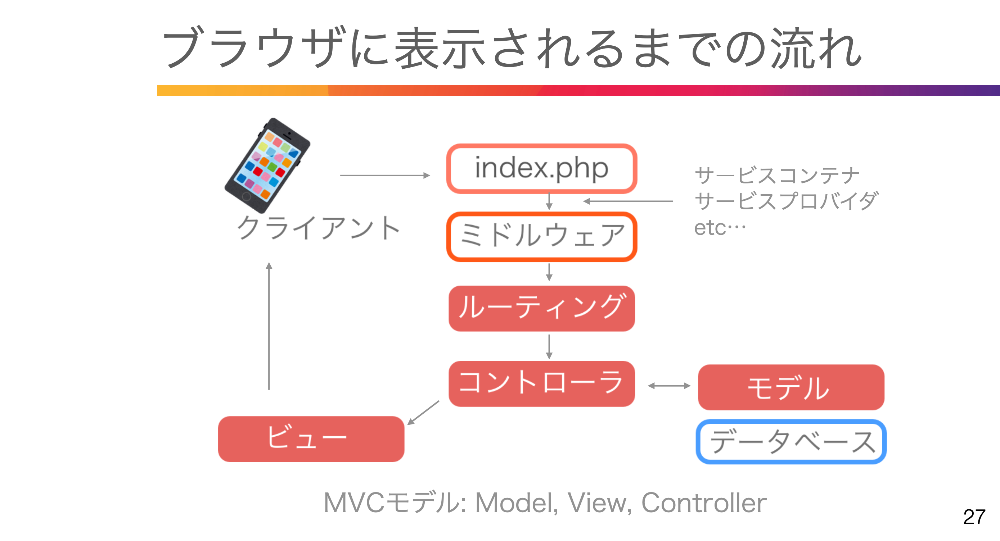

# 12. Laravel Breeze

### Larevel Breeze インストール
composer require laravel/breeze "1.*" --dev

php artisan breeze:install  
npm install && npm run dev

マニュアル: スターターキット


# 13. 表示がおかしくなったら
```php
resources/views/layouts/app.blade.phpにコードの書き換え
resources/views/layouts/guest.blade.phpにコードの書き換え
 <!-- Styles -->
<link rel="stylesheet" href="{{ asset('css/app.css') }}">

<!-- Scripts -->
<script src="{{ asset('js/app.js') }}" defer></script>
```


# 15. 表示の流れ、ルーティング


ミドルウェアでログインしているかどうか認証

```php
use Illuminate\Support\Dacades\Route; //Routeを読み込む
use App\Http\Controllers\Auth\RegisteredUserController; //コントローラを読み込む

Route::get('/register', //Route::getかpost(url))
[RegisteredUserController::class,'create']) //[]でコントローラ名、メソッド名
->middleware('guest') //middleware guestだったら
->name('register'); //名前付きルート
```

マニュアル: 認証
->ルートの保護、リダイレクト、ガードの指定、ログイン回数制限


# 16. ルート->コントローラ->ビュー

```php
コントローラファイル群
app/Http/Controllers/Auth

authenticatedSession //認証セッション
confirmablePassword //パスワード確認
emailVerificationNotification //メール検証通知
emailVerificationPrompt //メール検証プロンプト
newPassword //新しいパスワード
passwordResetLink //パスワードセットリンク
registeredUser //ユーザー登録
verifyEmail //メール検証

ビューファイル群
Resources/views/auth

confirm-password //パスワード確認
forget-password //パスワード忘れ
login //ログイン
register //新規登録
reset-password //パスワードリセット
verify-email //メール検証
```


# 17. 日本語化対応

### Laravel Breeze 日本語化
マニュアル下部の4つの言語ファイルをresource/lang/jaフォルダは以下に配置
(*Laravel9の場合は lang/jaフォルダ)
(Laravel10hはLangディレクトリがデフォルトで存在せず、自分で作成する必要があります。php artisan lang:publish)